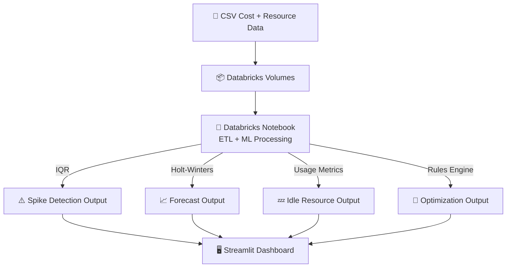

<div align="center">

# 🚀 FinOps Cost Spike Detection & Optimization Platform  
### AI-Powered Cloud Cost Monitoring • Forecasting • Optimization


🔍 Detect Spikes • 🔮 Forecast Cloud Spend • 💤 Identify Idle Resources • 🧠 Optimize Costs  
</div>

---

## ✨ Overview

This project is a **complete FinOps automation system** built using  
**Databricks + Python + Streamlit**.

It detects cost spikes using IQR, forecasts cloud spending 30 days into the future,  
identifies idle resources, and generates optimization recommendations — all inside a  
beautiful **Streamlit dashboard**.

> 📌 Ideal for **Data Engineering**, **FinOps**, **Cloud**, and **ML** portfolios.

---

## 🌟 Key Features

### 🔍 1. Spike Detection (IQR Model)
- Detects unusual cost spikes  
- Highlights abnormal cost days  
- Generates human-readable spike explanations  

### 🔮 2. Cost Forecasting (Holt-Winters)
- 30-day cost forecasting  
- Considers trend + seasonality  

### 💤 3. Idle Resource Detection
Flags wasteful resources where:
- CPU < 10%  
- Memory < 20%  
- Idle hours > 24  
- Missing tags  

### 🧠 4. Optimization Engine
Recommends:
- Rightsizing / downsizing  
- Shutting down idle servers  
- Improving tagging  
- Storage optimization  

### 🖥️ 5. Streamlit Dashboard
- Cost trend visualizations  
- Spike detection display  
- Forecast graph  
- Idle resource table  
- Optimization recommendations  

---

## 🏗️ Architecture



---

## 🧰 Tech Stack

| Layer | Technologies |
|-------|--------------|
| **ETL & ML** | Python, Pandas, NumPy, Statsmodels |
| **Platform** | Databricks Lakehouse |
| **Dashboard** | Streamlit, Matplotlib |
| **Storage** | Databricks Volumes / CSV |
| **Deployment** | GitHub + Render / Streamlit Cloud |

---

## 📂 Project Structure

```txt
finops-dashboard/
│
├── app.py                          # Streamlit dashboard
├── requirements.txt                # Python dependencies
│
├── daily_cost_output.csv           # Trend data
├── spikes_output.csv               # Detected spikes
├── idle_resources_output.csv       # Idle resource metrics
├── optimization_output.csv         # Optimization suggestions
│
└── README.md                       # Documentation
```

---

## ▶️ Run Locally

```bash
git clone https://github.com/<your-username>/finops-dashboard.git
cd finops-dashboard
pip install -r requirements.txt
streamlit run app.py
```

Dashboard opens at:

```
http://localhost:8501
```

---

## 🌍 Live Demo

🔗 **Your Streamlit App:**  
https://finopsdashboard-2cmzkagpkdsrzekxriuxpx.streamlit.app/

---

## 🚀 Deploy on Render

**Build Command**
```bash
pip install -r requirements.txt
```

**Start Command**
```bash
streamlit run app.py --server.port $PORT --server.address=0.0.0.0
```

---

## 📸 Dashboard Preview

_Add your screenshot here_

```
📊 Cost Trend  
⚠️ Spike Alerts  
📈 Forecast Curve  
💤 Idle Resources  
🧠 Optimization Suggestions  
```

---

## 🎯 Why This Project Matters

✔ Reduce cloud waste by **30–60%**  
✔ Automate FinOps operations  
✔ Predict future cloud costs  
✔ Detect anomalies before they explode  
✔ Enterprise-ready architecture  

---

## 🚀 Future Enhancements

- 🔗 Real-time cloud ingestion  
- 🤖 Auto-remediation  
- 🧮 Kubernetes cost allocation  
- 📊 Multi-cloud comparison  
- 🧠 LLM-based FinOps Assistant  

---

## 👤 Author — Anand Goyal

GitHub: **https://github.com/AnandGoyal264**  

⭐ If this project helped you, please star the repo!

